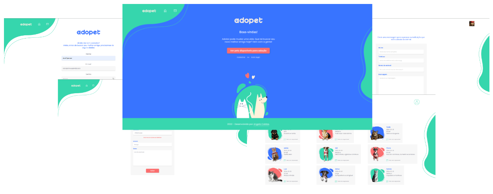
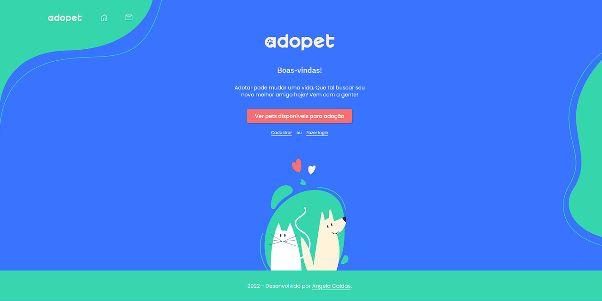

<div id='top' align="center">

  # Challenge Backend: AdoPet

  > **AdoPet 🐾** is a pseudo company that acts as an intermediary between people who want to adopt pets and NGOs that remove animals from the streets.
  
  <p align="center">
    
  </p>

  <a>English</a> -
  <a href="../README.md">Potuguese</a>

</div>

<div id='tech'>

  ## 🤖 Technologies used

</div>
<div align="center">
  <a href='https://nodejs.org/' target='_blank'>
  <a href='https://react.dev/' target='_blank'>
  
  <a href='https://expressjs.com/' target='_blank'>
  <a href='https://jwt.io/' target='_blank'></a>
  <a href='https://www.postgresql.org/' target='_blank'></a>
  <a href='https://sequelize.org/' target='_blank'></a>
  <a href='https://www.cypress.io/' target='_blank'></a>
  <a href='https://jestjs.io/' target='_blank'></a>
  <a href='https://www.docker.com/' target='_blank'></a>
  <a href='https://render.com/' target='_blank'></a>
  <a href='https://nodemon.io/' target='_blank'></a>
  <a href='https://docs.github.com/en/actions' target='_blank'></a>
  <a href='https://fakerjs.dev/' target='_blank'></a>
</div>

## 🦾 About the challenge

This project is currently in development as a result of a Back-End Challenge exclusively for students of [Alura](https://www.alura.com.br) tech school.

The challenge is to simulate a real work environment in which tasks are made available through Trello with weekly deliveries, for 4 weeks. Each task describes what the fictional client wants to be built. We have the freedom to make changes or follow new approaches depending on needs and creativity. We can also choose the technologies we want to develop for the project.


## 👨🏽‍💻 About development

In developing the API, [Express](https://expressjs.com/) was used as a framework for building web applications, ORM [Sequelize]() to abstract the integration with the SQL database, among other technologies listed <a to href='#tech'>☝🏾 just above</a>, all as a way to practice the concepts of libraries, tools and construction of RESTful APIs.

To integrate the API with the previously available Front-End, I explored the resources of [React](https://react.dev/) to make API calls with **UseEffect**, organize the authentication code via login through **hooks** and **contexts**, among other resources that were necessary during development and testing adjustments.

The API covers routes for managing users, pets, shelters, profiles, and permissions. As well as user authentication through login and authorization of access to routes through JWT tokens generated at login. In addition, there is also control via permission to routes per user profile.

For _unit_ and _integration tests_, the **API** [Jest](https://jestjs.io) was used, while for E2E tests on the **Front-end** [Cypress](https://www.cypress.io/) was used as a test runner.

I used [Docker](https://www.docker.com/) to build the image and [Docker Compose](https://docs.docker.com/compose/) to run the application and the database locally to support development and testing.

There are automated tests and builds performed by [GithHub Actions](https://docs.github.com/en/actions) every time a new commit is pushed to the main branch of the API repository. Once all checks are validated, a docker image is generated and published on [Docker Hub](https://hub.docker.com/repository/docker/jeffersonps/adopet-api/general).

The deployment of the API and Front-End is carried out by the [Render](https://render.com/) platform, also automatically following the same rule described above.

However, future code refactoring will be necessary after I evolve my studies.

- 🚀 [Visit the AdoPet website](https://adopet.sapituca.site/)

<a href='https://adopet.sapituca.site/' target='_blank'></a>

<div id="projects">

## 🏗️ Projects
- 🚀 [AdoPet API](https://github.com/jeff-pedro/adopet-api)
- 🐾 [AdoPet website](https://github.com/jeff-pedro/adopet-client)

</div>

## ⚙️ How to use this repository

This repository consists of two **submodules**, the API and the front-end.

It is possible to clone [projects](#projects) individually or through this repository via **[git submodules](https://git-scm.com/book/en/v2/Git-Tools-Submodules).**

Clone this repository by recursively updating modules
```shell
git clone --recurse-submodules https://github.com/jeff-pedro/challenge-backend-adopet.git
```

And read the [project](#projects) to learn how to use them.

---

<a href='#top'>☝🏾 Back to top</a>


